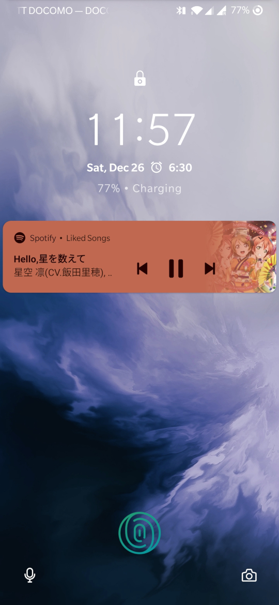
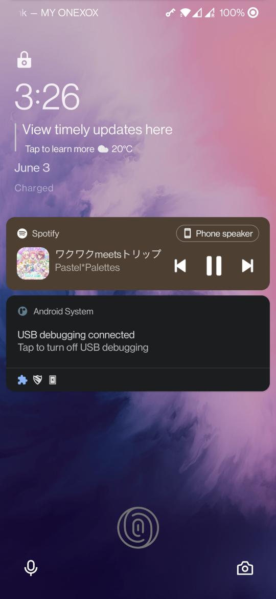

# Nekumori MOD
Xposed module. A collection of fixes for some apps to work properly, especially on OnePlus7.

## Fixes
- Rakuten Edy
```
The Rakuten Edy can work on a device without NFC-F, however it's not well tested. 
To use the app on an unsupported device, we need to bypass the device checking.
We spoof one of the supported device, Nexus 6 here. For more info, refer:
https://edy.rakuten.co.jp/howto/android/nfc/support/
```

- Google Daydream
```
With Magisk Pix3lify module, we can get Daydream VR support on unsupported device.
Almost everything work, however, the main scene of Daydream app is visually distorted for unknown reason.
Issue on Pix3lify:
https://github.com/Magisk-Modules-Repo/Pix3lify/issues/104
And if we spoof Pixel device here, the distortion bug disappear, very weird indeed...
(Tested on OnePlus7, not sure if this can solve the same bug on different device)
```
_Before_

_After_


- Japan Post Bank
```
USB debug mode bypass for Japan Post Bank app.
```

- Remove Lock Screen Album Art (OxygenOS 10)


- Remove Lock Screen Album Art (OxygenOS 11)
```
OnePlus added the shyt functionality back to the OxygenOS 11?
Don't worry, I got your back!
```
